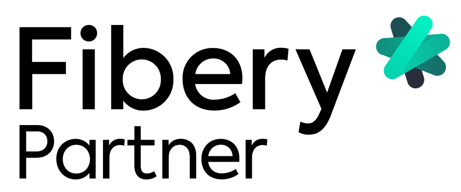

+++
title = 'Über SELFSCRUM'
date = "2022-03-03T11:00:00"
author = 'Martin'
description = ''
disableComments = true
+++

### Was ist SELFSCRUM?

SELFSCRUM hilft freien, offenen Schulen und Selbstlernern dabei, ihre Kompetenzen zu erweitern und selbstbestimmtes Lernen zu lernen.

Was heißt das? Wir brauchen eine vereinte Anstrengung aller Beteiligten, um kindliches und jugendliches Lernen auf ein neues Niveau zu heben, das der heutigen Zeit und den zukünftigen großen Herausforderungen gerecht wird. Wir sind  der festen Überzeugung, dass Schule und Lernen komplett neu gedacht werden müssen.

Die gute Nachricht ist, dass es bereits viele gute Ansätze gibt. Sie kommen aus verschiedensten Richtungen. Sei es aus klassichen Schulen, wo viele motivierte Menschen mit guten Ideen versuchen, ein erstarrtes System am Leben zu halten, sei es aus der freien Wirtschaft, wo Wissen und Lernen heute überlebensnotwendige Eigenschaften sind. Und nicht zuletzt die gesellschaftlichen Kräfte der aktuellen Nachhaltigkeitsbewegungen, die gelernt haben, sich auf moderne Art und Weise zu organiseren, um ihren Anliegen eine Stimme zu geben.

Wie jedes komplexe System entsteht so eine Struktur nicht über Nacht und nicht im stillen Kämmerlein eines Tüftlers, sondern an Lernorten, wo mutige und innovative Menschen sich trauen, anders zu denken und zu handeln. 

#### Wie alles begann

SELFSCRUM hat trotz seines jungen Alters bereits eine bewegte Geschichte hinter sich. Vielfältige Handlungsstränge haben sich hier in einer kurzen Zeitspanne überlagert und ein Momentum erzeugt, dass zum einen eher noch suchend-zufällig ist, zum anderen aber die Kumulation unserer Konzeptarbeit der letzten Jahre darstellt. Das alles gleichzeitig offen und noch sehr in Bewegung - ich vermute, es wird so bleiben. 

#### Hackathon

Alles begann mit Überlegungen zum EUvsVirus Hackathon 2020. Wir waren nach unserer Schulgründung lange auf der Suche nach einem Angebot, das unsere freie Schule bei der Durchführung der Lernprozesse unterstützt - und das nicht nur aus Schulsicht, sondern auch für die Schüler:innen selber. In der aktuellen Corona-Situation kam noch die neue Dimension „Remote-Learning“ dazu. Wir kamen auf die Idee, eine Software-Lösung genauso frei zu gestalten wie die Schule und skizzierten kurz vor dem Hackathon digitale Whiteboard-Apps mit integrierten programmierten Eweiterungen so aufzuwerten, dass die freie Bearbeitungsform erhalten bleibt und trotzdem die notwendigen Lernaktivitäten unterstützt werden.

Das Hackathon-Wochenende war ein guter Start, die Überlegungen zu diskutieren und ein paar Anwendungsfälle durchzuspielen. Mit dem internationalen Team hatten wir zweieinhalb intensive Tage, die nach einer durchgearbeiteten Nacht zum Montag in einem fertigen Video, einer Projektpräsentation und der neu erstellten selfscrum.org Website endeten.

Da wir keine Software-Entwickler im Team hatten, konnten wir leider auch keinen Prototypen bauen, wie eigentlich geplant. Nachdem wir es trotzdem bis in die Finalistenrunde des Wettbewerbs schafften, konnten wir leider keinen Gewinnerplatz einnehmen.

#### Weiteres Feedback

Beim Barcamp des deutschen EUDEC-Treffens eine Woche später und bei einem Online-Meetup des Vereins Raum für natürliches Lernen e.V. konnte ich die Idee erneut vorstellen und aus dem Feedback weitere Anforderungen sammeln. Danach wurde es zunächst erst einmal wieder etwas ruhiger um SELFSCRUM als Software.

#### Die „richtige“ Vision finden

Das führte unmittelbar zur nächsten Frage: Welche Prozesse sind in der Schule als Lernraum überhaupt relevant und welche nicht? Das ist bei freien und offenen Schulen ja immer wieder ein Hin und Her zwischen dem Wunsch nach einer individuellen, angstfreien Gestaltung der Lernprozesse für das einzelne Kind und den notwendigen Nachweisprozessen, die Schulen in Deutschland aufgrund der gesetzlichen Rahmenbedingungen haben und die auch unser „freies“ Denken immer noch viel stärker prägen als wir es wollen.

Was ist also -ganz pragmatisch aus dem Schulbetrieb heraus betrachtet- die „richtige Sicht“ auf Lernprozesse und ihre Administration?

Wir haben beim EU-Hackathon und auch beim deutschen EUDEC-Treffen ein Wochenende später festgestellt, dass die Effizienz der „Prozesse“ oft viel zu stark in den Vordergrund rückt und der eigentliche Ursprung -das Lernen und die soziale Interaktion- dabei verloren geht.

Das möchten wir gerne system(at)isch ändern. Wir bieten einen methodischen Rahmen und ein Lernangebot, das durch die Schüler:innen angenommen werden kann und es trotz aller Freiheit und Flexibilität schafft, nicht nur Nachweise zu bringen, sondern vor allem den Lernprozess und die Lernfreude so zu stärken, dass wir Schüler:innen selber in Verantwortung lassen können, sich die Inhalte zu erschließen, die sie haben wollen.

#### Partner

Die besten Ergebnisse erzielt man nicht alleine, sondern im Verbund mit Partnern, so dass sich Kompetenzen ergänzen. Ich habe über die Jahre viel mit Software- und Beratungspartnern gearbeitet und habe einschätzen gelernt, mit welchen Partnern etwas geht und wo nicht. Die Auswahl hier ergibt sich aus der Praxis, ich habe mit jedem Partnerangebot selber schon gearbeitet.

{}
| | |
|----|----|----|
|  | Ersetze den größten Teil eurer IT durch ein einziges Tool 🤹‍♀️ Befreie dich von verstreuten Tools und nutze einfach Fibery für Strategie, Ideation, Roadmapping, Feedback Management und mehr. | https://fibery.io |
|  | All-in-One Collaboration Tool: Aufgaben, Projekte, Chat, Videokonferenzen, Whiteboards, Dokumente und mehr. Keine Kompromisse beim Datenschutz und Sicherheit. | https://www.stackfield.com |
{}

So in aller die Kürze die Geschichte von SELFSCRUM. Wir freuen uns über euer Feedback!